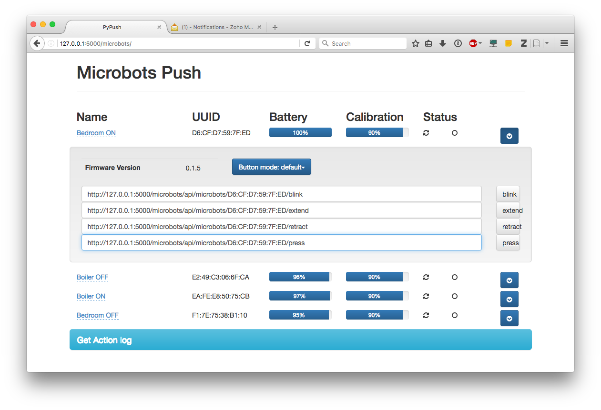

# Open Source Microbot Push Server

[](https://travis-ci.org/VRGhost/PyPush)

[Docker Image](https://hub.docker.com/r/vrghost/pypush/)

A 3rd-party implementation of Microbot Push service.

This project is planned to contain three separate elements:
  * [python library](#microbot-push-library) to interact with Microbot Push devices via BLE
  * [daemon](#microbot-push-daemon) that handles most of the BLE-related chores (e.g. device discovery/pairing/etc)
  * [simple web interface](#web-ui) to interact with the daemon

You can find a dump of my current understanding of the Microbot's low-level Bluetooth API [here](docs/microbot_ble_api.md)

## Running

### Bgapi
```bash
$ cd "${PY_PUSH_CHECKOUT_DIR}"
$ pip install -r ./requirements/prod.txt
$ ./bin/serve.sh --ble_driver bluegiga --ble_device /dev/tty.usbmodem1 web_ui
```

### PyBlueZ
```bash
$ sudo -i
# cd "${PY_PUSH_CHECKOUT_DIR}"
# pip install -r ./requirements/prod.txt
# pip install -r ./requirements/bluez.txt
# ./bin/serve.sh --ble_driver pybluez --ble_device hci0  web_ui
```

## Microbot Push Library

At the moment, the library supports two [BLE](https://en.wikipedia.org/wiki/Bluetooth_low_energy) stacks:
  * [Bluegiga](https://www.silabs.com/products/wireless/bluetooth/bluetooth-smart-modules/Pages/bled112-bluetooth-smart-dongle.aspx): available for all platforms that support USB COM devices, does not require root access, does require purchase of a $15 piece of hardware
  * PyBlueZ (custom fork): Linux-only, requires elevation to root to run. The implementation is more of proof-of-concept, BLE operations are somewhat unstable (causing I/O delays). Don't forget to deploy [PyBlueZ requirements](./requirements/bluez.txt) for this mode.


[Microbot Push Library Documentation](docs/PyPush_lib.md)

## Web UI



# Changelog

## 29 May 2017

Code:
* Fixed missing `createMicrobotFromUUID` method in the PyBlueZ stack (kudos to @javaftper)

Docker container:
* Now has embedded PyBlueZ support
* Updated to the latest revision of code
